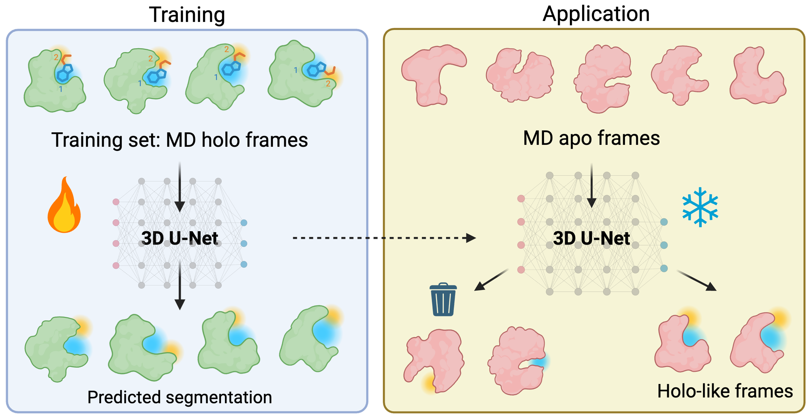

# FragBEST-Myo
**FragBEST-Myo** represents **Frag**ment-**B**ased protein **E**nsemble semantic **S**egmentation tool for **Myo**sin.  FragBEST-Myo is a proof-of-concept deep learning tool designed for Myosin, capable of segmenting regions of interest on protein surfaces into multiple fragment-bound regions.



## Table of Contents
* [Quick Start](#quick-start)
   * [Installation](#installation)
   * [Get started to use FragBEST-Myo](#get-started-open-jupyter-notebook-with-fragbest-myo-environment)
* [User Guide and Documentation](#user-guide--documentation)
* [Development documentation](#development-documentation)


## Quick Start
### Installation
FragBEST-Myo broadly follows the same preparation protocol as \(third-party tool 1\)[`MaSIF`](https://github.com/LPDI-EPFL/masif) to generate chemical features and surface files. As a result, several third-party libraries and programs are required, including 2\)`PyMesh`, 3\)`msms`, and 4\)`APBS`. 

To ensure compatibility with our workflow and Python 3.10, we patched portions of 1\)`MaSIF` and 2\)`PyMesh` (see change logs: [MaSIF compare](https://github.com/LPDI-EPFL/masif/compare/master...yuyuan871111:masif:master), [PyMesh compare](https://github.com/PyMesh/PyMesh/compare/main...yuyuan871111:PyMesh:main)). We also adapt code from the below package 5\)[`DeepDrug3D`](https://github.com/pulimeng/DeepDrug3D) (GPL‑3.0) and 6\)[`3D U‑Net PyTorch implementation`](https://github.com/zyl200846/3D-UNet-PyTorch-Implementation/tree/master) (MIT). The adapted sources are included under [`utils/thirdparty`](https://github.com/fornililab/FragBEST-Myo/tree/main/utils/thirdparty).


A complete inventory of third‑party components and licenses is provided in **[`THIRD_PARTY_NOTICES.md`](https://github.com/fornililab/FragBEST-Myo/blob/main/utils/thirdparty/README.md)**. Other Python dependencies are listed in `pyproject.toml`.
Third-party license texts are provided in `LICENSES/`. 

> **Important: We use [`pixi`](https://pixi.sh/latest/installation/) to manage the environment. The installation process will download external tools from their official sources, including 3\)`msms` (commercial users should review the license terms with the [author](https://ccsb.scripps.edu/msms/license/)) and 4\)`APBS`. And, 1\)`MaSIF`, and 7\)`FragBEST_pymol_plugin` (a pymol plugin for visualising the surface-rich PLY file in PyMOL. This tool is adapted from `MaSIF`'s `masif_pymol_plugin`.), are brought in via Git submodules. For 2\)`PyMesh`, we use a pre-built wheel file obtained from the [patched fork of PyMesh](https://github.com/yuyuan871111/PyMesh) to accelerate the installation.**


```bash
# Clone the repository
git clone https://github.com/fornililab/FragBEST-Myo.git

# Build the virtual environment
cd FragBEST-Myo
pixi run build  # this includes the process of downloading all required third-party packages from sources, please check licenses before running this
```

The installation now is done.

To verify the success of the installation, execute the following code:  

```bash
# Test the installation
pixi run poe test -n 4   # "-n 4" means using 4 threads to run the tests parallely
# Some warnings are expected, but all tests should pass.

# Test the installation of pymol environment
pixi run -e pymol pymol --version
# PyMOL 3.1.0 Open-Source (dbd983bdc8), 2025-10-30
```

### Get started: open jupyter notebook with FragBEST-Myo environment
First, you have to be in `~/path/to/FragBEST-Myo/tutorials`, you can run `jupyter notebook` to open a jupter notebook to run FragBEST-Myo tutorials.  
```bash
cd ~/path/to/FragBEST-Myo/tutorial

pixi run jupyter notebook
```

Use `ctrl-c` to stop your jupyter notebook.

See more details about third-party softwares and alternative way to activate the environment in [Get started](https://fragbest-myo.readthedocs.io/en/latest/getstarted.html). 

## User Guide & Documentation
The [User Guide](https://fragbest-myo.readthedocs.io/en/latest/) includes three tutorials to help you learn how to use FragBEST-Myo effectively:   

1. **Get started with FragBEST-Myo: Basics of TrajectoryHandler (Analyze a Frame in a Holo Trajectory)**  
   This tutorial is intended for users who want to learn how to manage molecular dynamics (MD) trajectories using `TrajectoryHandler` and understand the necessary files to prepare before running predictions.  
   - We demonstrate how to use `TrajectoryHandler` to analyze a frame in a holo trajectory (cardiac myosin with omecamtiv mecarbil) using the FragBEST-Myo pretrained model.  
   - [Tutorial Link](https://fragbest-myo.readthedocs.io/en/latest/notebooks/01_trajectory_handler.html)  

2. **Analyze PDBs from RCSB**  
   This tutorial is designed for users who want to compare and rank static structures from RCSB (or a protein ensemble consisting of multiple PDBs) to select the most suitable protein conformation for drug design.  
   - We demonstrate how to analyze PDBs from RCSB using `TrajectoryHandler`, `HoloDescriptor`, and `HoloDescriptorAnalyser`.  
   - [Tutorial Link](https://fragbest-myo.readthedocs.io/en/latest/notebooks/02_analyze_PDB_from_RCSB.html)  

3. **Detect Holo-like Conformations from an Apo Trajectory**  
   This tutorial is designed for users who want to identify the holo-like protein conformations from an apo trajectory for drug design.  
   - We demonstrate how to analyze an apo trajectory using `TrajectoryHandler` and leverage parallel processors with `TrajHandlerPreprocess` and `TrajHandlerPrediction` to speed up the analysis.  
   - [Tutorial Link](https://fragbest-myo.readthedocs.io/en/latest/notebooks/03_holo_like_form_detect.html)  

We also provide a [Q&A documentation](https://fragbest-myo.readthedocs.io/en/latest/qa.html) to address and answer some common questions you might have. Feel free to refer to it for additional guidance or troubleshooting!

Also, see the [Documentation](https://fragbest-myo.readthedocs.io/en/latest/index.html) for the argument and source code for document. 

## Development documentation
See [Development](https://fragbest-myo.readthedocs.io/en/latest/development.html).


## Citation
If you publish results produced with FragBEST-Myo or develop methods based on FragBEST-Myo, please cite the following [paper](https://doi.org/10.64898/2026.02.13.703009):

```
# ACS format
Yang, Y.-Y.; Pickersgill, R. W.; Fornili, A. Learning Fragment-Based Segmentation of Binding Sites from Molecular Dynamics: A Proof-of-Concept on Cardiac Myosin. bioRxiv February 16, 2026, p 2026.02.13.703009. https://doi.org/10.64898/2026.02.13.703009.
```

## License
Copyright (C) 2024-2026 Yu-Yuan Yang, Richard W. Pickersgill and Arianna Fornili

FragBEST-Myo is licensed under GPL-3.0.
